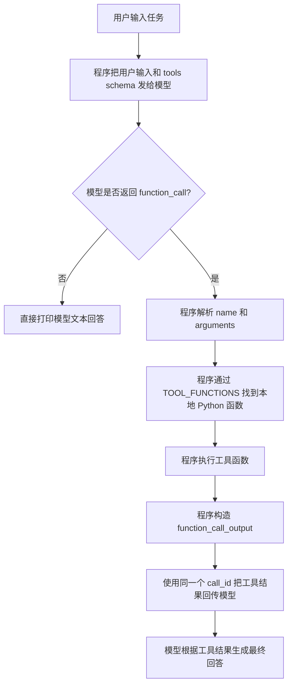

# Learn 5: 执行工具并把结果喂回模型

这是 Stage 1 的第五个代码示例。

## 这个示例做了什么

上一节 Learn 4 只解析模型返回的 tool/function call，不执行工具。

这一节会多走一步：程序根据模型返回的 `name` 和 `arguments`，执行真正的 Python 工具函数，然后把工具结果用 `function_call_output` 回传给模型。

整个流程是：



这一节只做一次工具调用闭环，不做循环。循环会放到 Learn 6。

官方参考：[Function Calling](https://developers.openai.com/api/docs/guides/function-calling)。

## 准备环境

下面的命令都在 `stage1` 目录下执行。

安装依赖：

```bash
pip install -r requirements.txt
```

Windows 如果没有配置 `pip` 命令，可以使用：

```bash
py -3 -m pip install -r requirements.txt
```

创建 `.env` 文件：

```bash
OPENAI_API_KEY=你的 API Key
OPENAI_BASE_URL=https://你的中转站地址/v1
OPENAI_MODEL=你的模型名
```

如果你直接使用官方 OpenAI API，可以删除 `OPENAI_BASE_URL` 这一行。

## 运行

```bash
python learn5-execute-tool/main.py
```

Windows 如果没有配置 `python` 命令，可以使用：

```bash
py -3 learn5-execute-tool/main.py
```

可以输入这些例子：

```text
计算 1 + 2 * 3
帮我查一下 Agent 是什么
读取 sample_note.txt
```

## 代码核心

### 本节代码流程

对应到 `main.py`，执行顺序是：

1. 定义 `TOOLS`：给模型看的工具说明书。
2. 定义 `TOOL_FUNCTIONS`：给程序看的函数分发表。
3. 第一次调用 `client.responses.create(...)`：让模型决定是否需要工具。
4. 如果模型返回 `function_call`：读取 `tool_call.name` 和 `tool_call.arguments`。
5. 调用 `call_tool(...)`：由 Python 程序执行真正的本地函数。
6. 追加 `function_call_output`：把工具结果和 `call_id` 一起放回上下文。
7. 第二次调用 `client.responses.create(...)`：让模型基于工具结果生成最终回答。

这里最容易混淆的一点是：模型不会直接运行 Python 函数。模型只返回调用意图，真正的函数调用发生在程序里的 `call_tool(...)`。

这一节最关键的是三个对象：

- `function_call`：模型发出的调用意图。
- `TOOL_FUNCTIONS`：程序里的工具分发表，用工具名找到真正的 Python 函数。
- `function_call_output`：程序把工具执行结果回传给模型的消息。

`call_id` 是连接这两步的关键：

```text
模型返回 function_call.call_id
程序回传 function_call_output.call_id
```

这两个 ID 必须一致，模型才知道“这份工具结果属于刚才哪一次工具调用”。

## 课堂讲解重点

这一节可以总结成一句话：

> 执行工具 = 程序接住模型的调用意图，运行本地函数，再把结果交还给模型组织最终回答。
