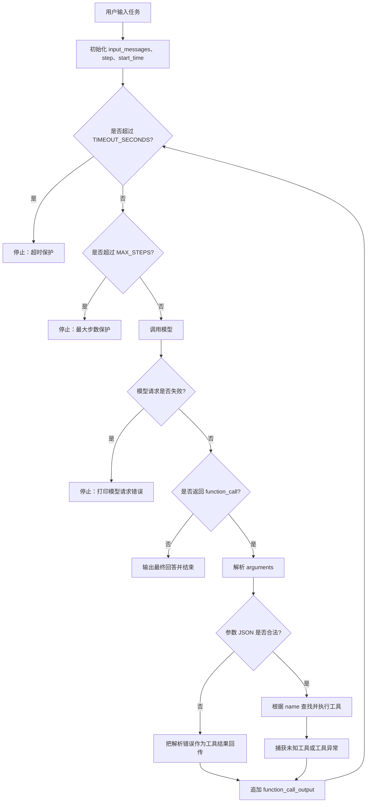

# Learn 6: 给 Agent Loop 加最大步数、超时和错误处理

这是 Stage 1 的第六个代码示例。

## 这个示例做了什么

Learn 5 只做一次工具调用闭环。

这一节把它扩展成一个最小 agent loop：模型可以选择工具，程序执行工具并回传结果，然后再次调用模型。这个过程会重复，直到模型不再返回 `function_call`，而是给出最终回答。

为了避免程序无限运行，这一节加入三个保护：

- 最大步数：`MAX_STEPS`
- 总超时：`TIMEOUT_SECONDS`
- 错误处理：参数解析失败、模型请求失败、未知工具、工具异常等

官方参考：[Function Calling](https://developers.openai.com/api/docs/guides/function-calling)。

## 准备环境

下面的命令都在 `stage1` 目录下执行。

安装依赖：

```bash
pip install -r requirements.txt
```

Windows 如果没有配置 `pip` 命令，可以使用：

```bash
py -3 -m pip install -r requirements.txt
```

创建 `.env` 文件：

```bash
OPENAI_API_KEY=你的 API Key
OPENAI_BASE_URL=https://你的中转站地址/v1
OPENAI_MODEL=你的模型名
```

如果你直接使用官方 OpenAI API，可以删除 `OPENAI_BASE_URL` 这一行。

## 运行

```bash
python learn6-agent-loop-controls/main.py
```

Windows 如果没有配置 `python` 命令，可以使用：

```bash
py -3 learn6-agent-loop-controls/main.py
```

可以输入这些例子：

```text
计算 1 + 2 * 3，然后告诉我结果
帮我查一下 Agent 是什么
读取 sample_note.txt，然后总结一下
你好，介绍一下你自己
```

如果想观察 agent loop 连续循环几次，可以输入：

```text
读取 sample_note.txt，找到里面的练习任务，完成计算后再回答我。
```

这个例子通常会经历多轮：

```text
第 1 轮：模型调用 read_file，读取 sample_note.txt
第 2 轮：模型看到文件里的表达式，再调用 calculator
第 3 轮：模型拿到计算结果，输出最终回答
```

实际循环次数由模型决定。如果模型一次性已经能回答，就会提前结束；如果它需要更多工具结果，就会继续进入下一轮。

## 代码核心

最小 agent loop 可以理解成：



也可以把代码结构简化成：

```text
for step in range(MAX_STEPS):
    调用模型
    如果模型返回 function_call:
        执行工具
        回传 function_call_output
        继续下一轮
    否则:
        输出最终回答
        结束
```

`MAX_STEPS` 和 `TIMEOUT_SECONDS` 很重要。没有这些限制时，如果模型一直选择工具，程序就可能一直循环下去。

## 本节代码流程

对应到 `main.py`，执行顺序是：

1. 设置 `MAX_STEPS` 和 `TIMEOUT_SECONDS`，给 agent loop 加运行边界。
2. 初始化 `input_messages`，放入 developer 消息和用户输入。
3. 进入 `for step in range(1, MAX_STEPS + 1)` 循环。
4. 每一轮先检查总超时，再调用模型。
5. 如果模型没有返回 `function_call`，说明已经得到最终回答，程序结束。
6. 如果模型返回 `function_call`，程序解析 `arguments`。
7. 参数合法时执行工具；参数不合法时把错误信息当作工具结果。
8. 程序追加 `function_call_output`，带上同一个 `call_id`。
9. 回到下一轮，让模型基于工具结果决定继续调用工具还是给最终回答。

Learn 6 和 Learn 5 的区别在于：Learn 5 只跑一次工具闭环，Learn 6 会重复这个闭环，并且在循环外加上停止条件和错误出口。

## 课堂讲解重点

这一节可以总结成一句话：

> Agent loop = 模型选择动作，程序执行动作，把结果交回模型，再决定下一步。

Stage 1 到这里就形成了一个最小 Agent：可以选择工具、执行工具、返回最终答案，并且有基本的运行边界。
