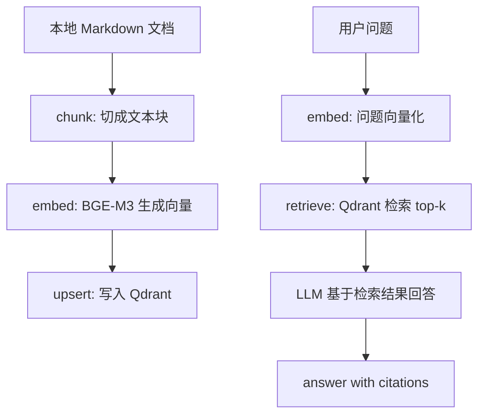

# Learn 1: RAG with Qdrant + BGE-M3

这是 Stage 2 的第一个代码示例。

本节目标是完整跑通检索增强生成，也就是：

```text
chunk -> embed -> retrieve -> answer with citations
```

这一节不做工具调用、不做记忆、不做 Agent Loop，只讲清楚 RAG 的最小闭环。

## 这个示例做了什么

- `chunk`：把本地 Markdown 文档切成适合检索的小段。
- `embed`：调用本地 BGE-M3 服务，把文本转成向量。
- `retrieve`：把向量写入 Qdrant，再根据用户问题检索相关 chunk。
- `answer with citations`：让模型只基于检索结果回答，并附上来源。

## 准备环境

下面的命令都在 `stage2` 目录下执行。

安装依赖：

```bash
pip install -r requirements.txt
```

Windows 如果没有配置 `pip` 命令，可以使用：

```bash
py -3 -m pip install -r requirements.txt
```

创建 `.env` 文件：

```bash
OPENAI_API_KEY=你的 API Key
OPENAI_BASE_URL=https://你的中转站地址/v1
OPENAI_MODEL=你的模型名

EMBEDDING_BASE_URL=http://localhost:8080
EMBEDDING_MODEL=BAAI/bge-m3

QDRANT_URL=http://localhost:6333
QDRANT_COLLECTION=stage2_learn1_rag
```

如果你直接使用官方 OpenAI API 作为最终回答模型，可以删除 `OPENAI_BASE_URL` 这一行。BGE-M3 的配置保持本地地址即可。

## 启动本地服务

启动 BGE-M3 embedding 服务：

```bash
docker run -p 8080:8080 beloved70020/bge-m3
```

启动 Qdrant：

```bash
docker run -p 6333:6333 -p 6334:6334 qdrant/qdrant
```

检查服务：

```bash
curl http://localhost:8080/health
curl http://localhost:6333
```

## 运行

```bash
python learn1-rag-qdrant-basic/main.py
```

Windows 如果没有配置 `python` 命令，可以使用：

```bash
py -3 learn1-rag-qdrant-basic/main.py
```

可以输入这些例子：

```text
Agent Loop 是什么？
RAG 为什么需要 chunk？
Qdrant 在这个流程里负责什么？
这份资料有没有讲浏览器自动化？
```

## 代码核心

这节课的流程可以理解成：



对应到 `main.py`，执行顺序是：

1. 从 `stage2/.env` 读取模型、embedding 服务和 Qdrant 配置。
2. 检查 BGE-M3 `/health` 是否可用。
3. 检查 Qdrant 是否可连接。
4. 读取 `docs/` 下的 Markdown 文档。
5. 把文档切成 chunk，并为每个 chunk 记录 `source`、`chunk_id` 和 `text`。
6. 调用 BGE-M3 `/v1/embeddings` 生成 chunk 向量。
7. 根据向量维度创建或重建 Qdrant collection。
8. 把 chunk 向量和 payload 写入 Qdrant。
9. 把用户问题也转成向量。
10. 从 Qdrant 检索最相关的 top-k chunk。
11. 把检索结果交给模型，让模型基于证据回答。
12. 输出带 citation 的最终回答。

## Citation 格式

本节要求模型使用固定引用格式：

```text
[source: agent_notes.md, chunk: 1]
```

引用只能来自本次 Qdrant 检索结果。如果资料不足，模型应该回答：

```text
根据当前资料不足以回答这个问题。
```

## 课堂讲解重点

这一节可以总结成一句话：

> RAG = 先查资料，再让模型基于资料回答，并告诉用户答案来自哪里。

BGE-M3 和 Qdrant 的分工也要讲清楚：

- BGE-M3 负责把文本转成向量。
- Qdrant 负责保存向量，并按语义相似度检索。
- LLM 负责把检索到的证据组织成自然语言回答。
