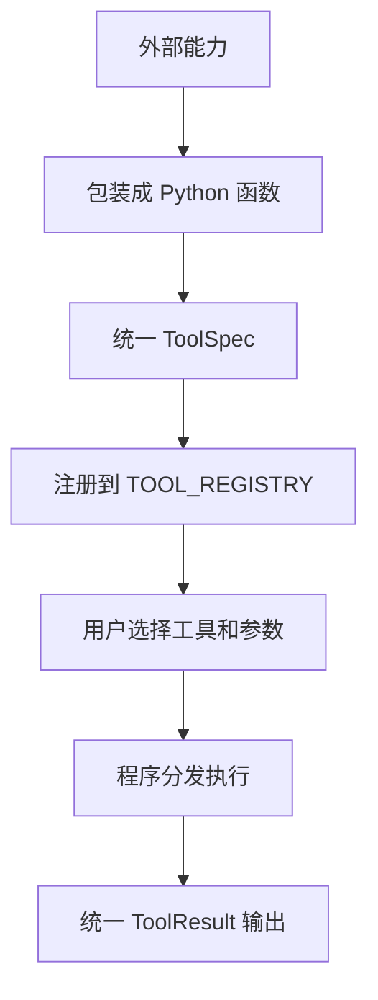

# Stage 2 Learn 2：把外部能力接成工具

这一节学习如何把搜索、数据库、文件、浏览器、代码执行这些外部能力包装成统一工具。

重点不是让模型自动选择工具，而是先看清楚：一个普通能力如何变成 Agent 可以管理、注册、分发和执行的工具。

## 本节目标

Stage 1 已经学过“工具函数”和“模型 tool call”。这一节往前走一步：把不同类型的真实能力接进同一个工具注册表。

本节包含 5 个工具：

| 工具名 | 代表能力 | 作用 |
| --- | --- | --- |
| `search_knowledge` | 搜索 | 用 BGE-M3 + Qdrant 检索 Learn 1 写入的知识库 |
| `query_database` | 数据库 | 查询本节内置 SQLite 课程表 |
| `read_file` | 文件 | 读取本节 `sample_files` 目录下的示例文件 |
| `fetch_webpage` | 浏览器/网页读取 | 访问网页并提取标题和正文摘要 |
| `run_python` | 代码执行 | 执行受限制的 Python 表达式或代码片段 |

## 工具函数和工具注册表

工具函数就是能执行某种能力的普通 Python 函数。例如 `read_file(path)` 会读取文件，`query_database(sql)` 会查询数据库。

工具注册表是把这些函数统一管理起来的地方。它记录：

- 工具名：调用方用什么名字找到这个工具。
- 工具说明：这个工具适合做什么。
- 参数说明：执行这个工具需要哪些输入。
- 执行函数：真正干活的 Python 函数。

在本节代码里，这个结构叫 `ToolSpec`，所有工具都放在 `TOOL_REGISTRY` 里。

## 统一返回格式

不同工具内部做的事情完全不同，但返回结果应该尽量统一。

本节所有工具都返回 `ToolResult`：

```python
ToolResult(
    ok=True,
    result="工具结果",
    error=None,
)
```

如果工具失败，就返回：

```python
ToolResult(
    ok=False,
    result=None,
    error="失败原因",
)
```

这样做的好处是：后续无论是命令行程序、Agent Loop，还是模型 tool call 执行器，都可以用同一种方式处理工具结果。

## 运行方式

先进入 Stage 2 目录并安装依赖：

```bash
cd stage2
pip install -r requirements.txt
```

Windows 如果没有配置 `pip` 命令，可以使用：

```bash
cd stage2
py -3 -m pip install -r requirements.txt
```

运行本节示例：

```bash
python learn2-tool-registry/main.py
```

Windows：

```bash
py -3 learn2-tool-registry/main.py
```

## 搜索工具的前置条件

`search_knowledge` 会复用 Learn 1 的 BGE-M3 和 Qdrant。

启动 BGE-M3：

```bash
docker run -p 8080:8080 beloved70020/bge-m3
```

启动 Qdrant：

```bash
docker run -p 6333:6333 -p 6334:6334 qdrant/qdrant
```

并先运行 Learn 1，让文档 chunk 写入 Qdrant：

```bash
py -3 learn1-rag-qdrant-basic/main.py
```

如果没有启动这些服务，只有 `search_knowledge` 会失败；其他四个工具仍然可以运行。

## 示例输入

### 文件工具

选择 `read_file`，输入：

```text
agent_tool_note.md
```

如果输入：

```text
../README.md
```

程序会拒绝读取，因为本节只允许访问 `sample_files` 目录内的文件。

### 数据库工具

选择 `query_database`，输入：

```sql
SELECT * FROM courses;
```

如果输入：

```sql
DROP TABLE courses;
```

程序会拒绝执行，因为本节数据库工具只允许 `SELECT` 查询。

### 网页读取工具

选择 `fetch_webpage`，输入：

```text
https://datawhalechina.github.io/Agent-Learning-Hub/
```

程序会返回页面状态码、标题和正文摘要。

### 代码执行工具

选择 `run_python`，输入：

```python
sum([1, 2, 3])
END
```

也可以输入：

```python
for i in range(3):
    print(i)
END
```

`run_python` 支持多行代码。输入代码后，单独输入一行 `END` 表示结束。

注意：本节代码执行工具只是教学示例，不是生产级安全沙箱。

### 搜索工具

选择 `search_knowledge`，输入：

```text
RAG 为什么需要 chunk？
```

如果 Learn 1 已经写入 Qdrant，会返回相关 chunk、来源和分数。

## 流程图



## 和前后章节的关系

- Stage 1 Learn 3：先定义本地工具函数。
- Stage 1 Learn 4：解析模型返回的 tool call。
- Stage 1 Learn 5-6：执行工具并形成最小 Agent Loop。
- Stage 2 Learn 2：把更多真实外部能力统一接成工具。

本节仍然不让模型自动调用工具。后续再把工具注册表交给模型，让模型根据任务选择工具。
