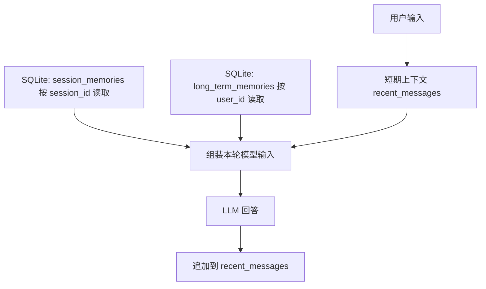

# Stage 2 Learn 3：区分短期上下文、会话记忆、长期记忆

这一节只讲一件事：**Agent 的记忆不是模型自动永久保存的，而是程序管理后再放回上下文。**

为了让概念足够清楚，本节不使用 Qdrant、不使用 embedding，只用 Python 内存和 SQLite。

## 三种记忆

| 类型 | 本节实现 | 生命周期 | 适合保存什么 |
| --- | --- | --- | --- |
| 短期上下文 | Python 列表 `recent_messages` | 当前程序运行中，清空或退出就没了 | 最近几轮对话 |
| 会话记忆 | SQLite 表 `session_memories`，按 `session_id` 区分 | 同一个 session 内可恢复 | 当前会话摘要、当前任务状态 |
| 长期记忆 | SQLite 表 `long_term_memories`，按 `user_id` 区分 | 跨 session 可见 | 用户偏好、稳定事实、长期知识 |

默认值：

```text
session_id = session-a
user_id = demo-user
```

## 运行方式

先进入 Stage 2 目录：

```bash
cd stage2
pip install -r requirements.txt
python learn3-memory-types/main.py
```

Windows：

```bash
cd stage2
py -3 -m pip install -r requirements.txt
py -3 learn3-memory-types/main.py
```

## 课堂演示建议

1. 选择“添加会话记忆”，在 `session-a` 写入：

```text
用户叫小明，正在学习 Agent 记忆。
```

2. 查看记忆，能看到 `session-a` 的会话记忆。

3. 切换到 `session-b`，再次查看记忆，看不到 `session-a` 的会话记忆。

4. 添加长期记忆：

```text
用户喜欢使用真实中间件做课程示例。
```

5. 在 `session-a` 和 `session-b` 之间切换，长期记忆都能看到。

6. 选择“清空短期上下文”，观察它只影响内存里的 recent messages，不影响 SQLite。

## 流程图



## 关键理解

- 短期上下文不是数据库，只是本轮程序内存。
- 会话记忆不是全局记忆，它属于某个 `session_id`。
- 长期记忆不跟某个 session 绑定，它属于用户，所以跨 session 可见。
- 记忆只有被程序读出来并放进 prompt，模型才可能使用它。
