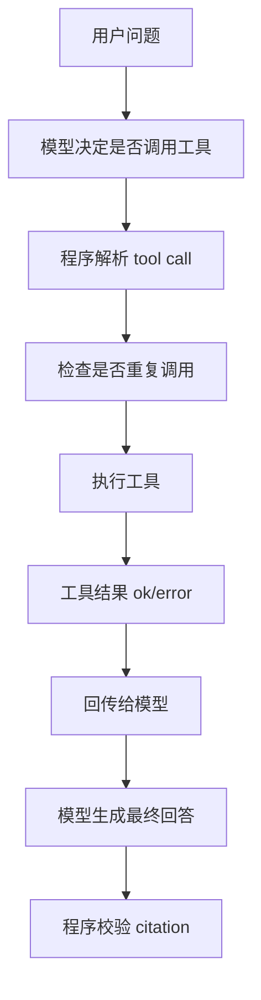

# Stage 2 Learn 4：处理工具失败、空结果、重复调用、幻觉引用

这一节不增加新工具，重点学习工具调用周围的保护逻辑。

Agent 不只是“会调用工具”，还要能处理工具失败、没有结果、重复调用，以及模型编造引用的问题。

## 本节处理的四类问题

| 问题 | 例子 | 程序怎么处理 |
| --- | --- | --- |
| 工具失败 | 读取不存在的文件 | 把失败原因作为工具结果返回给模型 |
| 空结果 | 检索不到资料 | 明确告诉模型资料不足，不能硬答 |
| 重复调用 | 同一工具同一参数反复调用 | 记录调用签名，超过次数后停止 |
| 幻觉引用 | 答案引用了不存在的 chunk | 程序用正则提取 citation，并和本次检索结果比对 |

## 运行方式

```bash
cd stage2
python learn4-tool-error-handling/main.py
```

Windows：

```bash
cd stage2
py -3 learn4-tool-error-handling/main.py
```

## 示例输入

工具失败：

```text
读取 missing.md
```

正常文件读取：

```text
读取 agent_note.md
```

计算：

```text
计算 1 + 2 * 3
```

检索：

```text
RAG 为什么需要 chunk？
```

资料不足：

```text
这份资料有没有讲浏览器自动化点击网页？
```

## 流程图



## 关键理解

- 工具失败不是异常崩溃，而是一个可被模型读取的结果。
- 空检索不是“让模型自由发挥”，而是要明确限制回答。
- 重复调用保护属于 Agent 控制层，不属于模型能力。
- citation 不能只靠提示词要求，最好由程序再校验一次。
