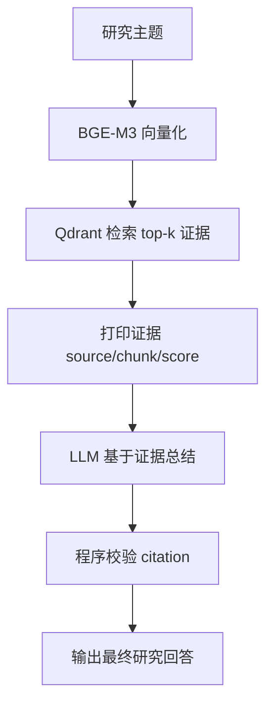

# Stage 2 Learn 5：带证据的资料研究助手

这一节是 Stage 2 的一个小产出：一个最小资料研究助手。

它不会做复杂 Agent Loop，而是采用固定流程：

```text
输入主题 -> 检索资料 -> 筛选证据 -> 总结回答 -> 校验引用
```

## 运行前准备

本节复用 Learn 1 写入 Qdrant 的知识库。请先启动服务：

```bash
docker run -p 8080:8080 beloved70020/bge-m3
```

```bash
docker run -p 6333:6333 -p 6334:6334 qdrant/qdrant
```

然后先运行 Learn 1，把示例文档写入 Qdrant：

```bash
cd stage2
python learn1-rag-qdrant-basic/main.py
```

Windows：

```bash
cd stage2
py -3 learn1-rag-qdrant-basic/main.py
```

## 运行本节

```bash
cd stage2
python learn5-research-assistant/main.py
```

Windows：

```bash
cd stage2
py -3 learn5-research-assistant/main.py
```

## 示例问题

```text
RAG 为什么需要 chunk？
```

```text
Qdrant 在这个流程里负责什么？
```

```text
Agent Loop 是什么？
```

如果输入资料外的问题，例如：

```text
这份资料有没有讲浏览器自动化点击？
```

程序应该回答：

```text
根据当前资料不足以回答这个问题。
```

## 输出格式

模型会被要求输出四部分：

```text
问题
结论
依据
引用
```

引用格式固定为：

```text
[source: agent_notes.md, chunk: 1]
```

## 流程图



## 关键理解

- 引用不是装饰，它应该指向真实检索到的证据。
- 模型负责总结，程序负责提供证据和校验引用。
- 资料不足时，可靠的 Agent 应该说“不足以回答”，而不是编造答案。
